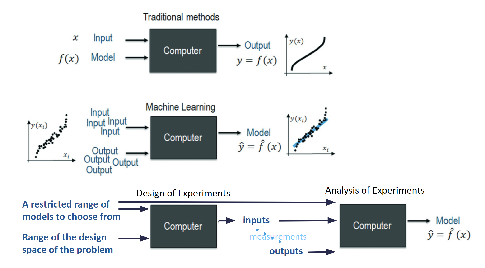

# Awesome Design of Experiments (DOE) 

*Adapted from [Navarro-Brul et al., React. Chem. Eng., 2022](https://pubs.rsc.org/en/content/articlelanding/2022/re/d1re00541c)*

The *Design of Experiments* is the theory of conceiving the optimal set of trials for model-testing experimentation.
DOE packages may have 4 different capabilities:

1. **Generation of the design**, e.g., generating factorial designs, latin hypercube, etc., upon the user request 
2. **Analysis of the design**, e.g., the ability of comparing the sampling optimality of different designs for the model hypothesis, evaluating the aliasing of factors, etc.
3. **Analysis of the response**, e.g., the ability of testing the model and fitting the coefficients. Most of open-source DOE packages lack this ability, relying on well-established statistic packages such as [statsmodels](https://www.statsmodels.org/stable/index.html) and [scikit-learn](https://scikit-learn.org/stable/).
4. **Design augmentation**, which is the typical pipeline of Active Learning (or Bayesian Optimization), using the response of the early trials to suggest a new set of trials that are a promising compromise between exploitation and exploration toward an optimum goal.

In the following we list a number of open-source packages that focus on the generation and analysis of designs.

> Don't hesitate to open an issue to report any package (with a reasonable users base) that is missing from this list

## Package statistics

These statistics are refreshed automatically on the first day of every month.
Commit metrics use each repository's default branch; lines of code exclude blanks and comments.

<!-- package-stats:start -->
_Last refreshed: **2026-07-18**_

| Package | Stars | Last commit | Commits | Lines of code |
| --- | ---: | --- | ---: | ---: |
| [PyDOE](https://github.com/pydoe/pydoe) | 326 | 2026-07-17 | 181 | 13,733 |
| [DOEPY](https://github.com/tirthajyoti/doepy) | 166 | 2020-09-25 | 56 | 7,943 |
| [dexpy](https://github.com/statease/dexpy) | 31 | 2018-06-17 | 247 | 6,549 |
| [diversipy](https://github.com/DavidWalz/diversipy) | 9 | 2020-03-09 | 39 | 1,709 |
| [Definitive Screening Design](https://github.com/danieleongari/definitive_screening_design) | 14 | 2024-05-28 | 48 | 895 |
| [pyLHD](https://github.com/toledo60/pyLHD) | 1 | 2024-03-21 | 88 | 72,747 |
| [BoFire](https://github.com/experimental-design/bofire) | 397 | 2026-07-16 | 687 | 64,231 |
| [OApackage](https://github.com/eendebakpt/oapackage) | 38 | 2026-02-04 | 959 | 128,482 |
| [PyOptEx](https://github.com/mborn1/pyoptex) | 23 | 2026-06-10 | 341 | 24,512 |
| [Pyomo.DoE](https://github.com/Pyomo/pyomo) | 2,486 | 2026-07-13 | 31,310 | 441,379 |
| [OpenTURNS](https://github.com/openturns/openturns) | 340 | 2026-07-16 | 7,757 | 563,774 |
| [SciPy QMC](https://github.com/scipy/scipy) | 14,827 | 2026-07-18 | 37,890 | 663,500 |
| [Pyro OED](https://github.com/pyro-ppl/pyro) | 9,022 | 2026-07-10 | 2,516 | 100,342 |
| [OpenMDAO DOE Driver](https://github.com/OpenMDAO/OpenMDAO) | 754 | 2026-07-17 | 20,871 | 196,186 |
| [IDAES PySMO Sampling](https://github.com/IDAES/idaes-pse) | 328 | 2026-07-16 | 9,487 | 620,471 |
| [SALib](https://github.com/SALib/SALib) | 995 | 2026-07-17 | 2,074 | 65,885 |
| [SMT](https://github.com/SMTorg/smt) | 897 | 2026-06-22 | 1,665 | 136,013 |
| [UQpy](https://github.com/SURGroup/UQpy) | 361 | 2025-08-19 | 3,058 | 33,244 |
| [DoEgen](https://github.com/sebhaan/DoEgen) | 102 | 2025-04-24 | 80 | 4,386 |
<!-- package-stats:end -->

## General-purpose and dedicated DOE packages

This section contains packages whose primary purpose, or a substantial standalone
part of their public API, is the generation and analysis of experimental designs.

### PyDOE - [GitHub](https://github.com/pydoe/pydoe), [Docs](https://pydoe.github.io/pydoe/)

An actively maintained collection of classical, optimal, space-filling, mixture,
screening, and sequential designs. This is the successor to the older `pyDOE2`
fork previously linked here.

- Factorial designs: `fullfact()`, `ff2n()`, `fracfact()`,
  `fracfact_by_res()`, `fracfact_opt()`, `pbdesign()`, `gsd()`, `fold()`,
  `john_three_quarter_design()`, `block_full_factorial()`
- Latin-square designs: `latin_square()`, `graeco_latin_square()`,
  `hyper_graeco_latin_square()`
- Mixture designs: `simplex_lattice_design()`, `simplex_centroid_design()`,
  `mixture_axial_design()`, `extreme_vertices_design()`,
  `mixture_process_design()`
- Response-surface designs: `bbdesign()`, `ccdesign()`,
  `doehlert_shell_design()`, `doehlert_simplex_design()`, `star()`,
  `block_ccdesign()`, `small_composite_design()`
- Space-filling designs: `lhs()`, `oa_lhd()`, `sliced_lhs()`, `nested_lhs()`,
  `maximin_design()`, `minimax_design()`, `maxpro_design()`,
  `nearly_orthogonal_lhs()`
- Low-discrepancy sequences: `sobol_sequence()`, `halton_sequence()`,
  `hammersley_sequence()`, `rank1_lattice()`, `korobov_sequence()`,
  `faure_sequence()`, `niederreiter_sequence()`
- Sensitivity and robust designs: `morris_sampling()`, `saltelli_sampling()`,
  `taguchi_design()`, `definitive_screening_design()`,
  `supersaturated_design()`
- Optimal designs: `optimal_design()` with `a_optimality()`,
  `c_optimality()`, `d_optimality()`, `e_optimality()`, `g_optimality()`,
  `i_optimality()`, `s_optimality()`, `t_optimality()`, and
  `v_optimality()` criteria; search algorithms include `fedorov()`,
  `modified_fedorov()`, `detmax()`, and `sequential_dykstra()`
- Sequential designs: `sequential_design()`, `expected_improvement()`,
  `probability_of_improvement()`, `upper_confidence_bound()`

### DOEPY - [GitHub](https://github.com/tirthajyoti/doepy), [Docs](https://doepy.readthedocs.io/en/latest/)

Another collection of "classical" design of experiments.

* Full factorial: `build.full_fact()`
* 2-level fractional factorial: `build.frac_fact_res()`
* Plackett-Burman: `build.plackett_burman()`
* Sukharev grid: `build.sukharev()`
* Box-Behnken: ``build.box_behnken()``
* Box-Wilson (Central-composite) 
  * with center-faced option: ``build.central_composite()`` with ``face='ccf'`` option
  * with center-inscribed option: ``build.central_composite()`` with ``face='cci'`` option
  * with center-circumscribed option: ``build.central_composite()`` with ``face='ccc'`` option
* Latin hypercube (simple): ``build.lhs()``
* Latin hypercube (space-filling): ``build.space_filling_lhs()``
* Random k-means cluster: ``build.random_k_means()``
* Maximin reconstruction: ``build.maximin()``
* Halton sequence based: ``build.halton()``
* Uniform random matrix: ``build.uniform_random()``

### dexpy - [GitHub](https://github.com/statease/dexpy), [Docs](https://statease.github.io/dexpy/)

Yet another collection of "classical" design of experiments.

- Fractional Factorial: `build_factorial(factor_count, run_count)`
- Full Factorial: `build_full_factorial(factor_count)`
- Central Composite: `build_ccd(factor_count, alpha='rotatable', center_points=1)`
- Mixture Simplex Lattice: `build_simplex_lattice(factor_count, model_order=<ModelOrder.quadratic: 2>)`
- Mixture Simplex Centroid: `build_simplex_centroid(factor_count)`
- Optimal Designs: `build_optimal(factor_count, **kwargs)`

Analysis of the design:

- Statistical Power: `f_power(model, design, effect_size, alpha)`
- Alias list: `alias_list(model, design)`

### diversipy - [GitHub](https://github.com/DavidWalz/diversipy), [Docs](https://diversipy.readthedocs.io/en/latest/index.html)

Collection of algorithms for uniform sampling, and related topics.
 
- `cube` - Uniform sampling from the unit hypercube
  - `cube.stratify_conventional`: stratification of the unit hypercube
  - `stratify_generalized`: generalized stratification of the unit hypercube
  - `cube.latin_design`: generate a random latin hypercube design matrix
  - `cube.improved_latin_design`: generate an ‘improved’ latin hypercube design matrix
  - `cube.rank1_design`: design matrix for a rank-1 lattice
  - `cube.sample_halton`: generate a Halton point set
  - `cube.sample_maximin`: maximize the minimal distance in the unit hypercube with extensions
  - `cube.sample_k_means`: in its default setup, this algorithm converges to a centroidal Voronoi tesselation of the unit hypercube
  - `cube.grid`: create conventional grid in the unit hypercube
- `simplex` - Uniform sampling on the unit simplex
- `polytope` - Uniform sampling from convex polytopes
- `subset` - Select diverse subsets
  - `subset.psa_partition`: partition the data set into the given number of clusters with the part-and-select algorithm
  - `subset.psa_select`: select representatives points with the part-and-select algorithm
  - `subset.select_greedy_maximin`: greedily select a subset according to maximin criterion
  - `subset.select_greedy_maxisum`: greedily select a subset according to maxisum criterion.

Analysis of the design:

- `indicator.solow_polasky_diversity`: Solow-Polasky diversity
- `indicator.weitzman_diversity`: Weitzman diversity
- `indicator.sum_of_dists`: square root of the sum of all pairwise distances
- `indicator.average_inverse_dist`: average inverse distance
- `indicator.separation_dist`: minimal pairwise distance
- `indicator.wmh_index`: quality index of Wahl, Mercadier, and Helbert
- `indicator.sum_of_nn_dists`: sum of nearest-neighbor distances
- `indicator.unanchored_L2_discrepancy`: unanchored L2 discrepancy

### Definitive Screening Design - [GitHub](https://github.com/danieleongari/definitive_screening_design)

Implementation of the DSD in python: a small design aimed to screen all factors for second order models.

- `dsd.generate(n_num, n_cat, factors_dict=None, method='dsd', min_13=True, n_fake_factors=0)`

Analysis of the design:

- `dsd.analysis.get_map_of_correlations(X, effects)`

### pyLHD - [GitHub](https://github.com/toledo60/pyLHD), [Docs](https://toledo60.github.io/pyLHD/), [WebApp](https://share.streamlit.io/toledo60/pylhd-streamlit/main/pyLHD_streamlit.py)

Package focused on the Latin Hypercube Design (LHD), to generate and analyze several variants of this design.

- Classical latin hypercube: `pyLHD.LatinHypercube(size, seed, scramble)`

Analysis of the design:

Average Absolute Correlation, Maximum Absolute Correlation, Maximum Projection Criterion ([Joseph 2015](https://academic.oup.com/biomet/article-abstract/102/2/371/246859?redirectedFrom=fulltext)), Coverage measure, Inter-site Distance, Discrepancy, MaxiMin, Mesh Ratio, Phi_p Criterion. 

### BoFire - [GitHub](https://github.com/experimental-design/bofire), [Docs](https://experimental-design.github.io/bofire/)

BoFire is a Bayesian Optimization Framework Intended for Real Experiments. It contains nice features to generate a DoE when starting from scratch.

- D-, A-, G-, E-, K- optimization in a constrained design space
- Space filling in a constrained design space

Analysis of the design:

- `bofire.utils.doe.get_confounding_matrix()`

### OApackage - [GitHub](https://github.com/eendebakpt/oapackage), [Docs](https://oapackage.readthedocs.io/en/latest/index.html)

The Orthogonal Array package contains functionality to generate and analyse orthogonal arrays, optimal designs and conference designs.

- Generate (`oapackage.arraydata_t()`) and extend (`oapackage.extend_array()`) orthogonal arrays
- Conference designs (`oapackage.conference_t()`)
- D-Efficient optimized design (`oapackage.Doptimize()`)

Analysis of the design:

- D-, Ds-, A-, E- efficiency of the design (`.Defficiency()`, `.DsEfficiency()`, `.Aefficiency()`, `.Eefficiency()`)

### PyOptEx - [GitHub](https://github.com/mborn1/pyoptex), [Docs](https://pyoptex.readthedocs.io/en/stable/)

Package for model-based optimal experimental design with continuous,
categorical, mixture, constrained, blocked, split-plot, strip-plot, and
staggered-level experiments.

- Fixed-structure designs: `create_fixed_structure_design()` with `Factor`,
  `RandomEffect`, `create_parameters()`, and `default_fn()`
- Split-\(k\)-plot designs: `create_splitk_plot_design()` with the `Plot`
  randomization structure
- Cost-optimal CODEX designs: `create_cost_optimal_codex_design()`, which
  jointly optimizes the run count, run order, and factor transitions against a
  user-defined resource budget
- Optimality criteria: `Dopt()`, `Aopt()`, and `Iopt()`; custom metrics and
  linear models are also supported
- Design constraints and augmentation: factor-level constraints, custom
  categorical encodings, discrete numerical factors, covariates, Bayesian
  variance ratios, and prior designs

Analysis of the design:

- `evaluate_metrics()`, `estimation_variance()`,
  `plot_fraction_of_design_space()`,
  `plot_estimation_variance_matrix()`, `design_heatmap()`, and
  `plot_correlation_map()`
- Response analysis and model selection, including simulated annealing model
  selection (SAMS)

### Pyomo.DoE - [GitHub](https://github.com/Pyomo/pyomo), [Docs](https://pyomo.readthedocs.io/en/stable/explanation/analysis/doe/overview.html)

Model-based design of experiments integrated with Pyomo. It constructs and
optimizes Fisher information matrices (FIMs) for algebraic and dynamic models,
including models expressed with differential-algebraic equations.

- Main interface: `pyomo.contrib.doe.doe.DesignOfExperiments`
- Build and solve a design: `create_doe_model()` and `run_doe()`
- Compute information: `compute_FIM()` and `get_FIM()`
- Explore a design grid: `compute_FIM_full_factorial()` and
  `draw_factorial_figure()`
- Multiple experiments: `run_multi_doe_sequential()` and
  `run_multi_doe_simultaneous()`
- Sequential information updates: `update_FIM_prior()`
- Available objectives through `objective_option`: `determinant`
  (D-optimality), `trace` (A-optimality), `pseudo_trace`
  (pseudo-A-optimality), `minimum_eigenvalue` (E-optimality), and
  `condition_number` (modified E-optimality)

Analysis of the design:

- `get_sensitivity_matrix()`, `get_experiment_input_values()`,
  `get_experiment_output_values()`, `get_measurement_error_values()`, and
  `get_unknown_parameter_values()`

### OpenTURNS - [GitHub](https://github.com/openturns/openturns), [Docs](https://openturns.github.io/openturns/latest/user_manual/designs_of_experiments.html)

Uncertainty-quantification platform implemented in C++ with a comprehensive
Python API for deterministic, randomized, space-filling, and sequential
experimental designs.

- Classical designs: `Axial`, `Factorial`, `Composite`, and `Box`
- Randomized designs: `LHSExperiment`, `MonteCarloExperiment`,
  `BootstrapExperiment`, and `ImportanceSamplingExperiment`
- Deterministic and quadrature designs: `FixedExperiment`,
  `GaussProductExperiment`, `TensorProductExperiment`, `SmolyakExperiment`,
  and `experimental.FejerExperiment`
- Low-discrepancy designs: `LowDiscrepancyExperiment` with `FaureSequence`,
  `HaltonSequence`, `ReverseHaltonSequence`, `HaselgroveSequence`, or
  `SobolSequence`
- Optimized Latin hypercubes: `MonteCarloLHS` and
  `SimulatedAnnealingLHS`
- Sequential designs: `experimental.SequentialSamplingAlgorithm` and
  `experimental.LOLAVoronoi`

Analysis of the design:

- Space-filling criteria: `SpaceFillingC2`, `SpaceFillingMinDist`, and
  `SpaceFillingPhiP`
- Optimized-LHS results are exposed through `LHSResult`

### SciPy QMC - [GitHub](https://github.com/scipy/scipy), [Docs](https://docs.scipy.org/doc/scipy/reference/stats.qmc.html)

The `scipy.stats.qmc` submodule provides mature, high-performance
space-filling and quasi-Monte Carlo designs.

- Sampling engines: `qmc.Sobol`, `qmc.Halton`, `qmc.LatinHypercube`, and
  `qmc.PoissonDisk`
- Distribution-specific engines: `qmc.MultinomialQMC` and
  `qmc.MultivariateNormalQMC`
- `qmc.LatinHypercube` supports ordinary and strength-2
  orthogonal-array-based LHS designs, plus `random-cd` and `lloyd`
  post-optimization
- Generate or extend designs with `random()`, `random_base2()`,
  `fast_forward()`, and `reset()` on the relevant `QMCEngine`

Analysis of the design:

- `qmc.discrepancy()`, `qmc.geometric_discrepancy()`, and
  `qmc.update_discrepancy()`
- `qmc.scale()` maps unit-hypercube samples to and from physical bounds

## Specialist and framework-integrated DOE

The packages below are included because they expose a substantial, explicit
Python API for experimental design. They are not all standalone, general-purpose
DOE packages: some are probabilistic-programming, engineering, sensitivity,
surrogate-modeling, or uncertainty-quantification frameworks. Their repository
statistics therefore describe the host project rather than adoption of the DOE
submodule alone.

### Pyro OED - [GitHub](https://github.com/pyro-ppl/pyro), [Docs](https://docs.pyro.ai/en/stable/contrib.oed.html)

The dedicated `pyro.contrib.oed` module implements Bayesian optimal
experimental design for arbitrary Pyro probabilistic models. It is included for
its explicit DOE API, not for generic Bayesian optimization.

- Laplace expected information gain: `laplace_eig()`
- Nested Monte Carlo EIG: `nmc_eig()`
- Variational and posterior estimators: `posterior_eig()` and the deprecated
  compatibility function `vi_eig()`
- Neural lower-bound estimators: `donsker_varadhan_eig()`, `marginal_eig()`,
  and `lfire_eig()`
- Variational nested Monte Carlo: `vnmc_eig()`
- Designs can be evaluated individually or batched as tensors to select the
  candidate with the highest expected information gain

### OpenMDAO DOE Driver - [GitHub](https://github.com/OpenMDAO/OpenMDAO), [Docs](https://openmdao.org/newdocs/versions/latest/features/building_blocks/drivers/doe_driver.html)

Engineering design and multidisciplinary optimization framework whose
`DOEDriver` executes an OpenMDAO model over cases produced by interchangeable
DOE generators.

- Model execution: `DOEDriver(generator=...)`
- Random sampling: `UniformGenerator()`
- Classical designs: `FullFactorialGenerator()`,
  `PlackettBurmanGenerator()`, and `BoxBehnkenGenerator()`
- Space-filling designs: `LatinHypercubeGenerator()` with random, centered,
  maximin, center-maximin, or correlation criteria
- Reduced multilevel factorial designs:
  `GeneralizedSubsetGenerator(levels, reduction, n)`
- Existing designs: `ListGenerator()` and `CSVGenerator()`
- Cases may be distributed across processors using the driver's
  `run_parallel` and `procs_per_model` options

### IDAES PySMO Sampling - [GitHub](https://github.com/IDAES/idaes-pse), [Docs](https://idaes-pse.readthedocs.io/en/stable/explanations/modeling_extensions/surrogate/sampling/index.html)

One-shot sampling tools from the IDAES Process Systems Engineering framework,
primarily intended to create training and validation sets for surrogate models.

- Latin hypercube: `LatinHypercubeSampling`
- Full factorial: `UniformSampling`
- Low-discrepancy sequences: `HaltonSampling` and `HammersleySampling`
- Centroidal Voronoi tessellation: `CVTSampling`
- User-supplied distributions: `CustomSampling`
- Each sampler exposes `sample_points()` and supports selection from supplied
  data or generation inside user-provided bounds

### SALib - [GitHub](https://github.com/SALib/SALib), [Docs](https://salib.readthedocs.io/en/latest/api/SALib.html)

Sensitivity-analysis library with sampling plans specifically coupled to
global sensitivity methods.

- Sobol/Saltelli designs: `SALib.sample.sobol.sample()` and the deprecated
  compatibility function `SALib.sample.saltelli.sample()`
- Morris trajectories, including groups and optimized trajectories:
  `SALib.sample.morris.sample()`
- Fourier amplitude sensitivity test:
  `SALib.sample.fast_sampler.sample()`
- Fractional factorial designs: `SALib.sample.ff.sample()`
- Derivative-based global sensitivity sampling:
  `SALib.sample.finite_diff.sample()`
- Latin hypercube sampling: `SALib.sample.latin.sample()`
- The fluent `ProblemSpec.sample_*()` interface connects generation directly
  to the matching `analyze_*()` methods

### SMT - [GitHub](https://github.com/SMTorg/smt), [Docs](https://smt.readthedocs.io/en/latest/_src_docs/sampling_methods.html)

Surrogate Modeling Toolbox with a focused sampling API for computer
experiments.

- Uniform random designs: `Random(xlimits=...)(nt)`
- Full factorial designs: `FullFactorial(xlimits=...)(nt)`, including
  dimension weights and optional clipping
- Latin hypercube designs: `LHS(xlimits=..., criterion=...)(nt)`
- LHS criteria: `center`, `maximin`, `centermaximin`, `correlation`, and
  enhanced stochastic evolutionary optimization (`ese`)
- Adapted pyDOE designs: `BoxBehnken`, `PlackettBurman`, `Factorial`, and
  `Gsd`, all implementing the `PyDoeSamplingMethod` interface

### UQpy - [GitHub](https://github.com/SURGroup/UQpy), [Docs](https://uqpyproject.readthedocs.io/en/latest/sampling/)

Uncertainty-quantification framework with classical, stratified, simplex, and
adaptive sampling algorithms.

- Random sampling: `MonteCarloSampling`
- Latin hypercubes: `LatinHypercubeSampling` with `Random`, `Centered`,
  `MaxiMin`, `MinCorrelation`, or a user-defined `Criterion`
- Stratification: `TrueStratifiedSampling` and
  `RefinedStratifiedSampling`
- Uniform simplex designs: `SimplexSampling`
- Sequential surrogate-based sampling: `AdaptiveKriging` with learning
  functions such as `ExpectedImprovement` and `ExpectedFeasibility`
- Active learning for polynomial chaos: `ThetaCriterionPCE`
- Sampling is executed with `run()` and generated points are available through
  `samples` and, where applicable, `samplesU01`

### DoEgen - [GitHub](https://github.com/sebhaan/DoEgen), [Docs](https://github.com/sebhaan/DoEgen/blob/main/MANUAL.md)

Tool for generating and evaluating optimized mixed-level designs containing
numerical and categorical factors, followed by experiment-result analysis.

- Optimize mixed-level designs: `doegen.doegen.optimize_design()`
- Construct supported high-dimensional orthogonal designs:
  `doegen.doegen.gen_highD()`
- Evaluate imported or generated designs:
  `doegen.doegen.evaluate_design2()`
- Configuration-driven generation:
  `python -m doegen.doegen settings_design.yaml`
- Response analysis:
  `python -m doegen.doeval settings_expresults.yaml`

Analysis of the design:

- Center and level balance, orthogonality, two-way interaction balance and
  coverage, canonical correlations, and D-, D1-, D2-, A-, A1-, and
  A2-efficiency
- Automatic minimum, optimal, and best run-count suggestions
- Factor importance, response correlations, pairwise response maps, RMSE, and
  ranking of the best observed parameter combinations

## Considered but not included

These projects implement relevant DOE ideas but were not added to the main
package statistics because they do not yet meet the same combined standard for
adoption, packaging, documentation, and continuous testing. They are recorded
here so they can be reassessed as they mature.

- [discopt-doe](https://github.com/jkitchin/discopt-doe) — a promising JAX
  plugin with classical, model-based optimal, model-discrimination, and
  sequential designs. It was first released in July 2026 and currently has
  almost no independent adoption history.
- [MIDDoE](https://github.com/zuhairblr/middoe) — an active, peer-reviewed
  model-identification and model-discrimination DOE package. Its user base is
  still very small, its documentation remains limited, and no continuous test
  workflow was found.
- [PyOED](https://gitlab.com/ahmedattia/pyoed) — a broad scientific OED
  framework covering Fisher-information criteria, expected information gain,
  sensor placement, inverse problems, and data assimilation. It currently lacks
  a PyPI distribution and a visible continuous-integration pipeline, which makes
  installation and verification less accessible than the included packages.
